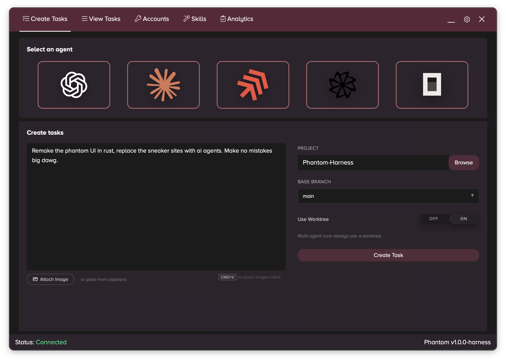
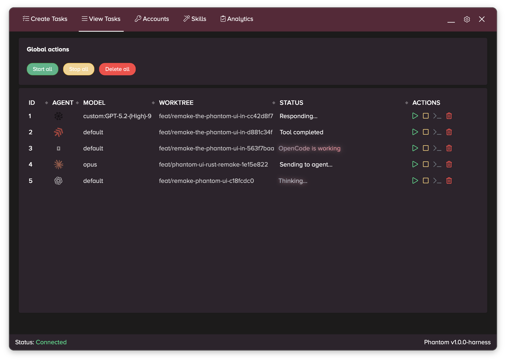
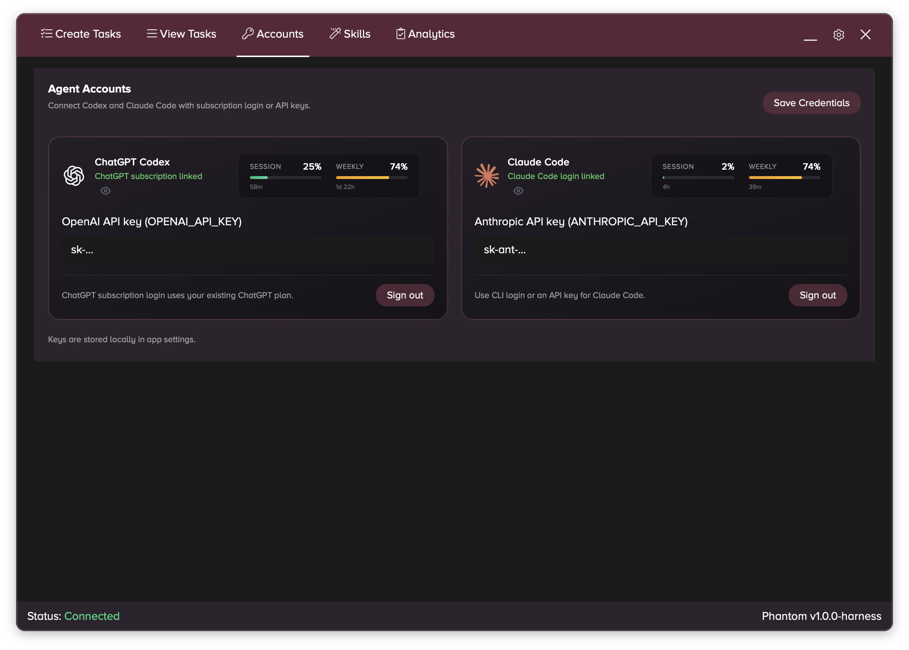
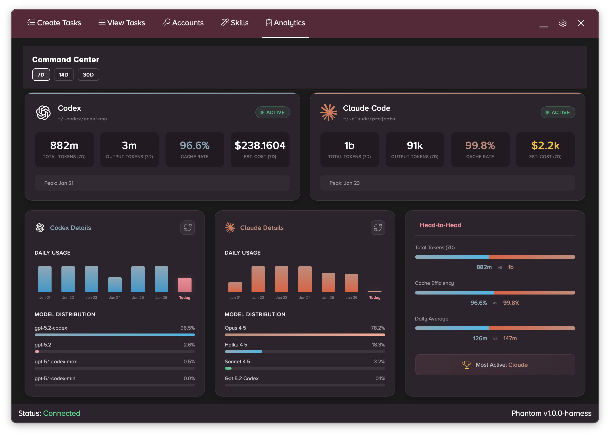
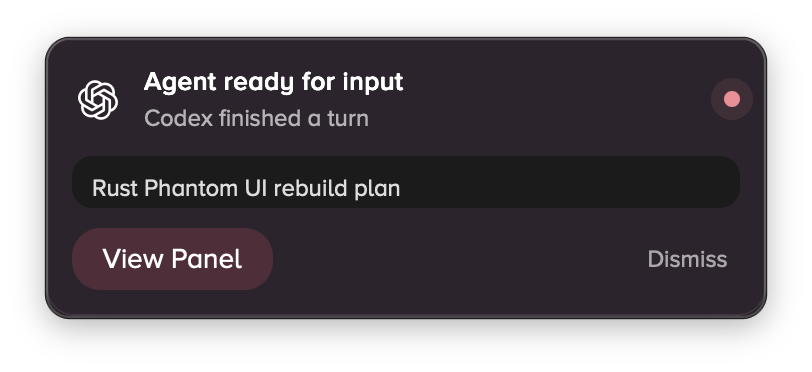

<p align="center">
  
</p>

<h1 align="center">Phantom</h1>

<p align="center">
  <strong>Your AI agents. One cockpit.</strong>
</p>

<p align="center">
  A desktop app that lets you run Claude Code, Codex, Amp, and more — simultaneously, from a single interface.
  <br>
  No more terminal juggling. No more tab chaos. Just point, click, ship.
</p>

---

## The Problem

You've got Claude Code in one terminal. Codex in another. Maybe Amp running somewhere. You're alt-tabbing like crazy, trying to remember which agent is working on what branch, burning through your rate limits without knowing it.

**Phantom fixes that.**

---

## What It Does

<p align="center">
  
</p>

**Pick an agent. Write a prompt. Hit go.**

Choose from Codex, Claude Code, Amp, Droid, or OpenCode. Select your model, pick your project folder, and let the agent loose. Phantom handles the rest — spawning processes, managing state, tracking progress.

---

<p align="center">
  
</p>

**Run multiple agents at once.**

See all your tasks in one place. Different agents, different models, different branches — all running in parallel. Each task gets its own isolated git worktree, so agents never step on each other's toes.

---

<p align="center">
  
</p>

**One login to rule them all.**

Connect your ChatGPT subscription and Claude Code account with OAuth. Or paste in API keys if that's your style. Phantom shows your session and weekly usage so you never get blindsided by rate limits.

---

## MCP (Local)

Phantom exposes a local MCP server when the app is running. Use it to control tasks from external clients.

See `docs/mcp.md` for setup, endpoints, and available tools.

<p align="center">
  
</p>

**The Command Center.**

This is where it gets fun. See your token usage across both agents. Compare cache efficiency. Watch the daily usage charts. Find out who's winning the head-to-head battle (spoiler: it's probably the british dude Claude).

- **Token tracking** — Know exactly how many tokens you're burning
- **Cost estimates** — See the damage before your invoice does
- **Model distribution** — Which models are doing the heavy lifting
- **Head-to-head** — Because everything's better with a leaderboard

### Command Center Integrations

The Command Center pulls issues and tasks from your development tools. Here's how to connect each one:

#### GitHub

Uses the GitHub CLI (`gh`) — no token needed if you're already authenticated.

```bash
# Check if you're logged in
gh auth status

# If not, authenticate
gh auth login
```

#### Linear

1. Go to **[Linear Settings → API](https://linear.app/settings/api)**
2. Click **"Create new API key"**
3. Give it a label (e.g., "Phantom Harness")
4. Copy the key and paste it into the Command Center config

The key looks like: `lin_api_xxxxxxxxxx`

#### Sentry

1. Go to **[Sentry Settings → Auth Tokens](https://sentry.io/settings/account/api/auth-tokens/)**
2. Click **"Create New Token"**
3. Select these scopes:
   - `org:read` — List organizations
   - `project:read` — List projects
   - `event:read` — Read issues/events
4. Name it (e.g., "Phantom Harness") and create
5. Copy the token and paste it into the Command Center config

The token looks like: `sntrys_eyJpYXQ...`

> **Note:** Use a Personal Auth Token (not Organization) so you can access all your orgs/projects.

---

<p align="center">
  
</p>

**The Skill Tree.**

Visualize all your agent skills in an interactive orbital view. Personal skills, project skills — see what's loaded, what's active, and toggle them on or off. It's like a tech tree, but for AI capabilities.

---

### Shared Context

**Give your agents shared memory.**

When you're running multiple tasks on the same feature — one agent doing the backend, another on the frontend, a third writing tests — they normally have no idea what the others are doing. Shared Context fixes that.

1. **Create a context** — Use the Context dropdown when creating a task, or click the bookmark icon (🔖) on any completed task to assign it to a context after the fact
2. **Group related tasks** — Multiple tasks under the same context become aware of each other
3. **Automatic prompt hydration** — When you start a new task in a context, Phantom prepends a brief of what sibling tasks have done (their prompts, summaries, and compacted message history) so the agent picks up where others left off

The bookmark icon on each task row shows context status at a glance:
- **Hollow bookmark** — No context assigned
- **Solid blue bookmark** — Part of a shared context

This is lightweight shared memory between agent tasks — no external databases, no complex orchestration. Just SQLite and smart prompt injection.

---

<p align="center">
  
</p>

**Never miss a beat.**

Get notified when your agents need attention. Whether it's a native notification or a ping in your Discord server, Phantom keeps you in the loop without requiring you to stare at the screen.

---

## Features

- **Multi-agent orchestration** — Run Codex, Claude Code, Amp, Droid, and OpenCode from one app
- **Git worktrees** — Every task gets an isolated branch. No merge conflicts between agents.
- **Shared context** — Group related tasks so agents know what sibling tasks have done
- **Unified auth** — OAuth login for ChatGPT and Claude, or bring your own API keys
- **Usage tracking** — Session and weekly limits visible at a glance
- **Analytics dashboard** — Token usage, costs, model distribution, and agent comparisons
- **Discord integration** — Get notifications, create threads, and chat with your agents directly from Discord
- **Skills management** — Enable/disable SKILL.md files per agent
- **Keyboard shortcuts** — Navigate like a pro

---

## Getting Started

### Prerequisites

You'll need at least one of these installed:

- [Claude Code](https://docs.anthropic.com/en/docs/claude-code) (`claude` CLI)
- [Codex](https://github.com/openai/codex) (`codex` CLI)
- [Amp](https://ampcode.com) (`amp` CLI)
- [OpenCode](https://github.com/opencode-ai/opencode) (`opencode` CLI)

### Installation

Download the latest release for your platform:

| Platform              | Download                 |
| --------------------- | ------------------------ |
| macOS (Apple Silicon) | [Phantom.dmg](#)         |
| macOS (Intel)         | [Phantom.dmg](#)         |

Or build from source:

```bash
# Clone the repo
git clone https://github.com/zruss11/Phantom
cd Phantom

# Install dependencies and build
cargo tauri build
```

### First Run

1. **Connect your accounts** — Head to the Accounts tab and sign in with ChatGPT or Claude Code
2. **Pick a project** — Browse to your codebase
3. **Select an agent** — Click the logo of the agent you want to use
4. **Write your prompt** — Tell it what to build
5. **Hit Create Task** — Watch the magic happen

---

## Development

To run Phantom in development mode, you need to start a local web server for the GUI and then run Tauri.

### 1. Start the GUI server

The frontend needs to be served on port 8000. Open a terminal and run:

```bash
# Using Python (built-in)
cd gui
python3 -m http.server 8000

# Or using Node.js
npx serve gui -l 8000
```

Keep this running in the background.

### 2. Start Tauri dev mode

In a separate terminal:

```bash
cd src-tauri
cargo tauri dev
```

This will compile the Rust backend and open the app with hot-reload enabled. Changes to the GUI files will reflect immediately; Rust changes trigger a recompile.

### Building for Production

```bash
cargo tauri build
```

The built app will be in `src-tauri/target/release/bundle/`.

### Custom DMG (macOS)

The installer window can be customized to match Phantom's styling. After building:

```bash
scripts/dmg/build-dmg.sh
```

This produces a branded DMG at `src-tauri/target/release/bundle/dmg/Phantom-<version>-custom.dmg`.
Replace `scripts/dmg/phantom-dmg-bg.png` to update the installer background.

---

## Built With

- **[Tauri](https://tauri.app)** — Native desktop app framework
- **[Rust](https://rust-lang.org)** — Backend performance and reliability
- **Vanilla JS** — No framework overhead, just fast UI

---

## Why "Phantom"?

Years ago, we built a sneaker bot called Phantom by **GhostAIO**. It was a different era — Supreme drops, Yeezy splash pages, Footlocker queues (and cancels 🤣), and the never ending battle against bot protection updates and web developers.

Fast forward to now, and AI agents are the new automation frontier. When I started building this, the UI practically designed itself — same aesthetic, same task-based workflow, same feeling of orchestrating something powerful from a single cockpit. As AI models get better it's clear that the capabilities will only grow and having long agents will make more and more sense.

This project is equal parts nostalgia and evolution. The ghost lives on, just chasing different drops now.

**From copping kicks to shipping code.**

🌱 _We are groot._ 🌱

---

## License

MIT — do whatever you want with it.

---

<p align="center">
  <sub>Built with ❤️</sub>
</p>
